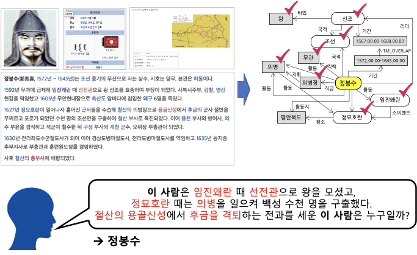
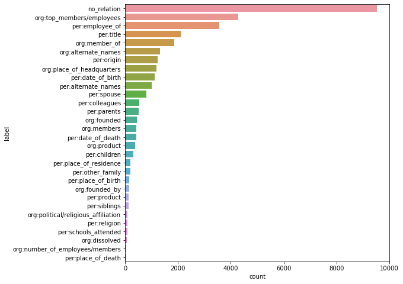
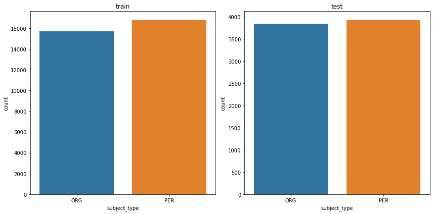
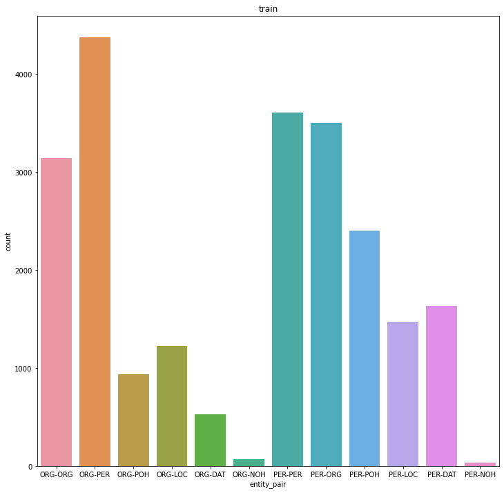

# Relation Extraction

## 프로젝트 개요

### 대회 소개

- 본 프로젝트는 네이버 부스트캠프 AI Tech 6기 NLP 트랙에서 진행한 교육용 대회 프로젝트입니다.
- Relation Extraction은 개체(entity)에 대한 속성과 관계를 예측하는 NLP task로, 문장 내 존재하는 두 개체 간의 관계를 30개 중 하나로 예측하는 프로젝트입니다.

### 평가 방법
- 본 프로젝트에서는 두 가지 평가 지표(no_relation을 제외한 micro F1 score, 모든 label에 대한 area under the precision-recall curve(AUPRC), micro F1 score를 우선시 함)를 사용해 모델의 성능을 평가합니다.

## 프로젝트 수행 과정

### Data description
- ***KLUE: Korean Language Understanding Evaluation*** 논문을 읽고 각 label과 feature가 나타내는 의미를 파악했습니다.
- label에 따라 가능한 entity type을 파악했습니다(예시: org:dissolved는 조직이 해산된 날짜를 나타내므로 가능한 subject type과 object type은 각각 ORG와 DAT).

### EDA
- train 데이터셋에서 label 분포를 확인한 결과, 다음과 같이 불균형한 분포를 보였습니다.

- train과 test 데이터셋에서 subject type 분포는 다음과 같습니다.

- train과 test 데이터셋에서 object type 분포는 다음과 같습니다.

- entity type 쌍을 나타내는 entity_pair feature를 추가하여 train과 test 데이터셋에서의 분포를 확인했습니다.

- train 데이터셋에서 label별 entity type의 갯수를 출력해 Data description 과정에서 추론한 label별 entity type과 일치하는지를 확인했습니다.
- 그 결과, 추론한 entity type과 일치하지 않는 데이터가 다수 존재했습니다. 일부 단어에서 label에 따라 entity type이 다르게 표기된 것을 확인할 수 있었습니다 (예시: '서울특별시'의 경우, label에 따라 entity type이 ORG, POH, LOC로 표기됨). 따라서, 추론한 label별 entity type을 label 예측에 활용할 수 없다고 판단했습니다.

### Data preprocessing
- subject_entity와 object_entity에 포함된 정보(word, start_idx, end_idx, entity_type)를 추출한 뒤 이를 각각의 column으로 저장했습니다.
- train 데이터셋에서 데이터가 중복되거나 label만 다른 46개의 데이터를 제거했습니다.

### Modeling

- ***An Improved Baseline for Sentence-level Relation Extraction*** 논문에서는 sentence-level의 relation extraction에서 typed entity marker를 사용했을 때 가장 높은 성능을 보였습니다.
- 이러한 방식을 적용하기 위해 모델 tokenizer에 entity type에 따라 24개의 special token을 추가했습니다. 
- 논문과 같이 모델의 input으로 넣을 문장에 typed entity marker를 추가하였고, 기존의 문장 앞에 수행할 task를 나타내는 query 문장을 추가했습니다.
- 모델의 output에서 CLS 토큰의 embedding과 subject entity 및 object entity를 나타내는 typed entity marker의 embedding을 추출한 뒤, 이를 하나로 결합하는 linear layer를 추가했습니다. 이렇게 결합한 embedding을 활용해 관계 예측에 활용했습니다.

## 프로젝트 결과
- 모델의 성능을 베이스라인 대비 7.0123점 향상시켰습니다.
  
  | model | score |
  |--------|--------|
  | Baseline | 71.0283 |
  | Typed entity marker | 78.0406 |

## 참고문헌
- Park, S., et al. (2021). ***KLUE: Korean Language Understanding Evaluation***. 	arXiv:2105.09680v4 [cs.CL].
- Zhou, W., & Chen, M. (2022). ***An Improved Baseline for Sentence-level Relation Extraction***. arXiv:2102.01373v4 [cs.CL].